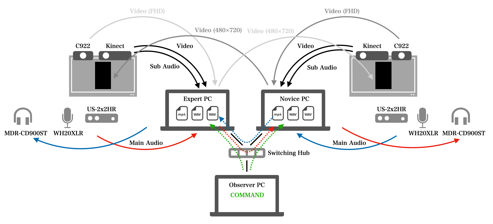
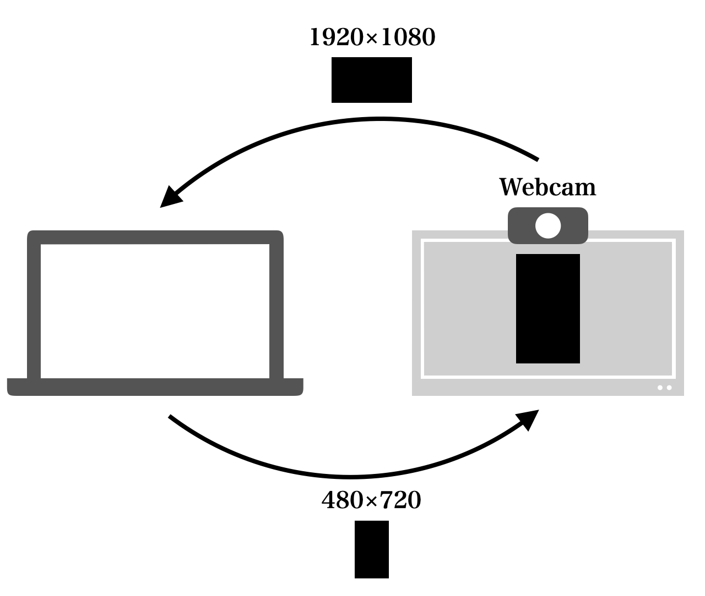
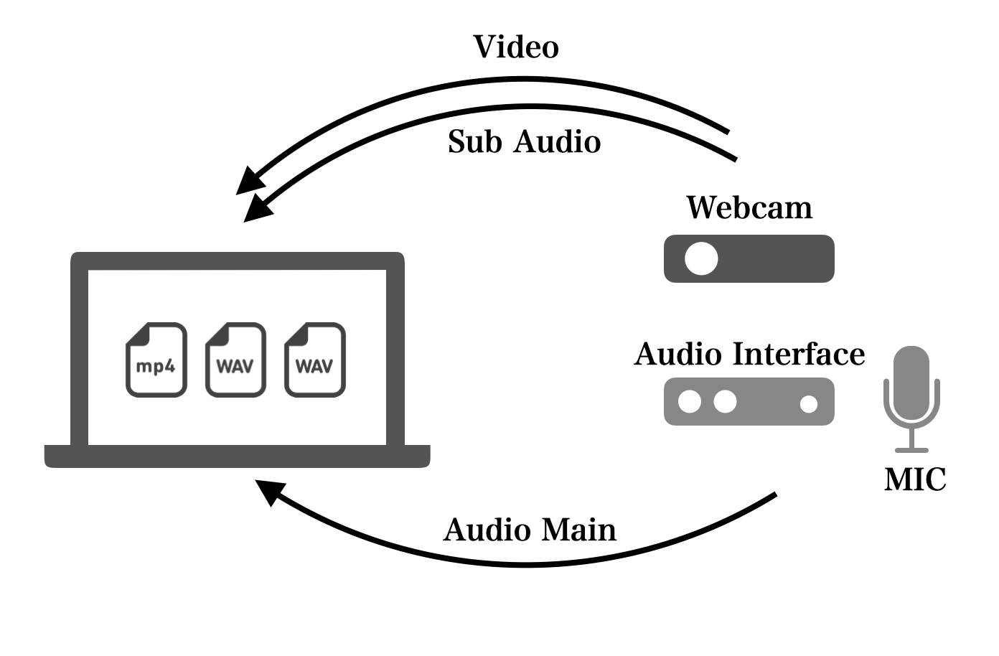
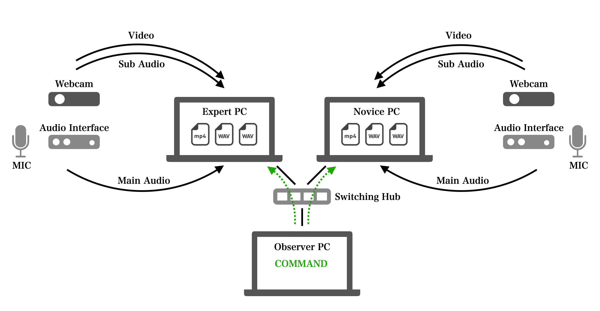
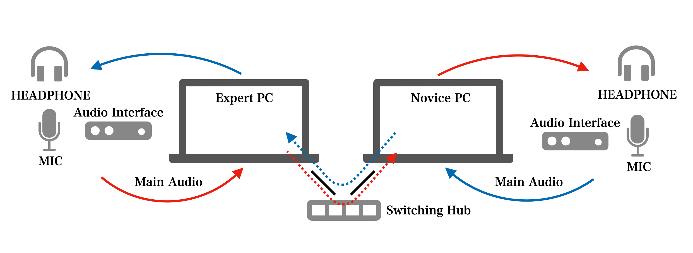
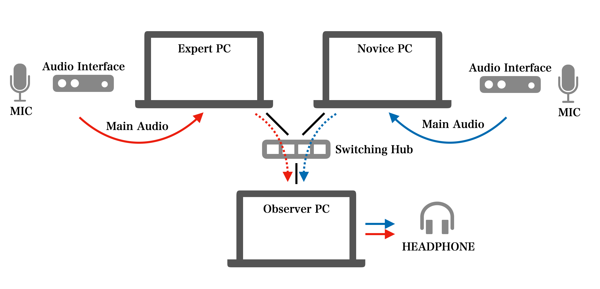

# NoXiRecorder

* **function **
  - Video and Audio Recording on a Single PC
  - Synchronize Two PCs to Record Video and Audio
  - Capture Webcam Cropped to 480x720
  - Server Sends Microphone Input and Receives It and Loops It Back to the Speaker
  - Server Sends Webcam and Receives It and Loops It Back to the Speaker

## Environment
* **Macbook Air (M1, 2020)**
  - macOS Monterey 12.5.1
  - Apple M1
  - RAM 8GB
* **ALIENWARE M15**
  - Windows 11 Home
  - Intel Core i7-11800H
  - RAM 16GB

## Installation
### Install ffmpeg
* **Windows**
  1. Download ffmpeg (https://www.gyan.dev/ffmpeg/builds/ffmpeg-release-full.7z)
  2. Unzip the downloaded file
  3. Place it in any folder and pass the path to "**ffmpeg-5.1.2-full_build/bin**".
* **Mac OS**
  1. Install via Homebrew: `brew install ffmpeg`

### Install NoXiRecorder
* Clone the github repository: `git clone https://github.com/ahclab/NoXiRecorder.git`
  - movement: `cd NoXiRecorder`
* Create conda env: `conda create -n recorder python=3.8`
  - source env: `conda activate recorder`
* Dependencies: 
  * Install requirements: `pip install -r requirements.txt`
  * Install repo: `pip install -e .`

## Setup
### Edit the settings file (NoXiRecorder/setting/...)
The main variables that need editing are listed below
  - **user**: Select the role of the computer to be used from "**expert**", "**novice**", "**observer**".
  - **device**: Enter the name of the equipment to be used for the recording
This is only valid for macOS and will not work on Windows due to system reasons.
  - **id**: Enter the device ID used for recording.
This ID will be used if the device name is not found or if Windows is used.
  - **ip**: Please enter ip address for server.

### Allow network traffic for security software
If network traffic is limited by security software, communication between computers is not possible.  
Be sure to turn it off.

## Run
### Capture

##### 1. Expert/Novice PC
```bash
python NoXiRecorder/capture.py
```
To end capture, press "e" on the capture screen.  

### Audio and Video Recording

If you want to take audio and video on one computer, please run the following program.  
##### 1. Expert/Novice PC
```bash
python NoXiRecorder/AVrecorder.py
```
Press "s" to start record, "e" to end record.  
If you get "AttributeError: module 'ffmpeg' has no attribute 'input'", please execute the following command.  
`pip uninstall python-ffmpge ffmpeg-python`  
`pip install ffmpeg-python`

If you get an "Invalid buffer size error", please review the settings file.

### NoXi Database Recordings

To synchronize two PCs for recording, run the following program.  
##### 1. Expert/Novice PC
```bash
python NoXiRecorder/server.påy
```

##### 2. Observer PC
```bash
python NoXiRecorder/client.py
```

###### Command
  - **time**: Check the current time
  - **ready**: Confirmation of communication status
  - **set option**: Setting Options  
    ex.) `--num 01`
  - **cat option**: Display of currently set options
  - **record**: Launch AVrecordeR
  - **start**: Start of recording
  - **end**: End of recording
  - **exit**: Disconnection of communication and program termination

### Transmission of audio between Expert and Novice

##### 1. Expert PC
```bash
python NoXiRecorder/monitorServerAudio.py --to_user novice
```

##### 2. Novice PC
```bash
python NoXiRecorder/monitorServerAudio.py --to_user expert
```

##### 3. Expert PC
```bash
python NoXiRecorder/monitorClientAudio.py --monitor_user novice
```

##### 4. Novice PC
```bash
python NoXiRecorder/monitorClientAudio.py --monitor_user expert
```

### Audio Monitoring of Expert/Novice by Observer

##### 1. Expert PC
```bash
python NoXiRecorder/monitorServerAudio.py --to_user observer
```

##### 2. Novice PC
```bash
python NoXiRecorder/monitorServerAudio.py --to_user observer
```

##### 2. Observer PC (observer)
```bash
python NoXiRecorder/monitorClientAudio.py --monitor_user expert
python NoXiRecorder/monitorClientAudio.py --monitor_user novice
```

## Tips
Since you will have multiple terminal windows open, we recommend installing the following terminal applications.  
* **Windows**
  1. Installation of WindowsTerminal (https://apps.microsoft.com/store/detail/windows-terminal/9N0DX20HK701?hl=ja-jp&gl=jp&icid=TopNavWindowsApps)
  2. Using Anaconda Python with PowerShell (https://helve-blog.com/posts/python/powershell-anaconda-python/)
* **Mac OS**
  1. Installation of Iterm2 (https://iterm2.com)
  
For monitoring of Expert and Novice by observers, it is recommended that a screen sharing application be used in conjunction.  
Chrome Remote Desktop, which is OS-independent, is the easiest.  
* **Remote Desktop**
  1. Installation of Chrome Remote Desktop (https://www.google.com/url?sa=t&rct=j&q=&esrc=s&source=web&cd=&cad=rja&uact=8&ved=2ahUKEwj_gIDyl8H8AhWprlYBHVS_DNkQFnoECBIQAQ&url=https%3A%2F%2Fremotedesktop.google.com%2F%3Fhl%3Dja&usg=AOvVaw0eAhneSA3hLZ5kRRLHbGUr)
  2. Set up a server (Expert/Novice)
  3. Set up a client (Observer)